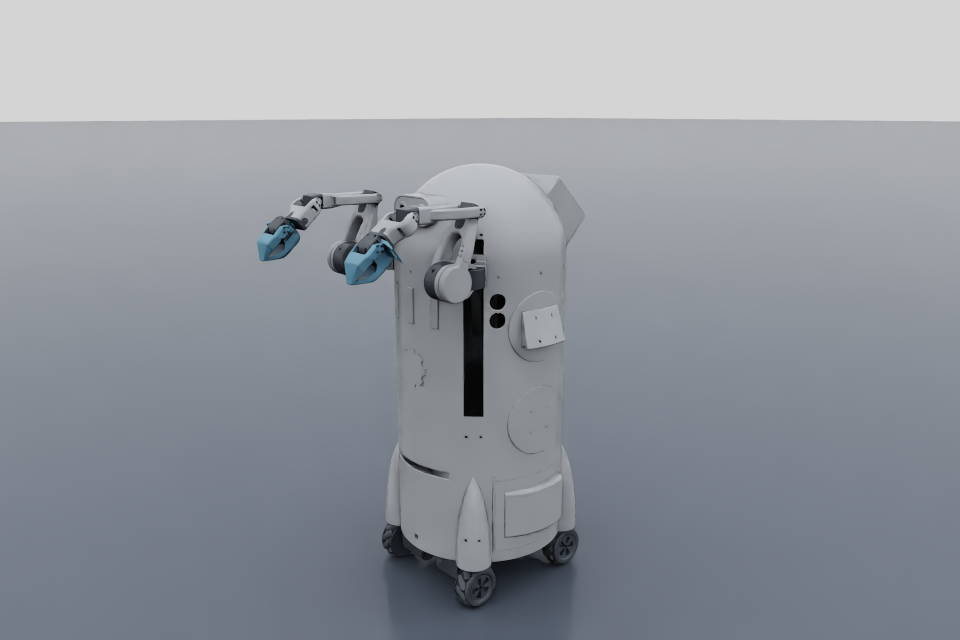

# Sourccey robot in NVIDIA Isaac Sim

The configured Sourccey robot from the sibling MuJoCo project, converted to an
Isaac Sim USD articulation with PhysX dynamics. All 17 joints, CAD axes, visual
meshes, masses, joint limits, and startup targets are carried across.



## Launch

On a fresh Windows checkout, install Python 3.10 or newer and run `setup.cmd` once. It downloads the official Isaac Sim runtime, builds the launcher, and generates the scene.

After setup, double-click **SourcceyIsaac.exe**. It opens Isaac Sim and the Sourccey controls.
The first launch can take several minutes while NVIDIA compiles shaders.
Startup output is written to `logs/latest.log`; Python errors also go to
`logs/error.log`. The launcher prevents duplicate launches through the `.exe`.
Use **Quit Sourccey** to close the application completely.

Keep the `.exe` in this folder. The multi-gigabyte `.runtime` is ignored by Git, so the launcher alone cannot start on a fresh clone. Unlike the small MuJoCo executable, Isaac needs
its multi-gigabyte `.runtime` directory and the project's models and scripts.
Copy the whole folder when moving this installation to another Windows PC.

Commands from this folder:

```bat
run.cmd
run.cmd --headless --seconds 5 --state artifacts\state.json
run.cmd --validate
run.cmd --build
run.cmd --unity-port 8765
```

`--no-traction` disables the equivalent mecanum forces. `--full-elevator-range`
extends the bottom elevator endpoint from -0.3104 m to -0.315 m; the upper
endpoint remains -0.0142 m. `--no-panel` opens only the Isaac interface.

## Controls and defaults

The panel has forward, strafe, and yaw sliders; release a base slider to stop.
**STOP BASE**, **Reset pose**, **Pause / resume**, joint sliders, grippers, and
per-arm XYZ reach targets match the MuJoCo application's controls. Joint
sliders display degrees. The following source targets are radians, except the
linear actuator, which is in meters:

| Joint | Startup target |
| --- | ---: |
| Linear actuator | -0.0142 m |
| Left / right shoulder pan | -0.785 / -0.801 rad |
| Left / right shoulder lift | +2.01 / -2.01 rad |
| Both elbow flexes | -2.0 rad |
| Left / right wrist flex | +0.691 / -0.723 rad |
| Both wrist rolls | 0 rad |
| Both grippers | -0.087266463 rad (-5 degrees, closed) |
| All four wheels | 0 rad/s |

Both elbow lower stops are -135 degrees. Joint limits use the same overrides
as MuJoCo. The elevator upper joint stop, target cap, and initial position are
all -0.0142 m. Reset restores the complete pose and stops the wheels.

XYZ targets are meters from the moving shoulder mount, with X forward, Y left,
and Z up. IK controls shoulder pan, shoulder lift, and elbow flex. Wrist flex
and roll remain independent. Freeze/resume preserves the last reach target
and discards slider changes made while frozen.

The optional receive-only Unity bridge accepts the existing
`sourccey.mujoco.v1` packet format so the existing Unity sender continues to work.
Use the same port in both applications. Only one simulator may bind that port
at a time. After 300 ms without valid input, the base stops and the arms hold
their last targets. No code here connects to the physical robot.
The Unity headset-to-Isaac workflow has not been exercised here.

## Runtime and hardware

This installation pins **Isaac Sim 5.1.0**. It supports the existing NVIDIA
591.86 driver; the current 6.1 release specifies a newer driver. 5.1 is an older,
now unsupported NVIDIA release. No system drivers are changed by this project.

This PC's RTX 2070 SUPER has 8 GB VRAM, below NVIDIA's published 16 GB minimum
for 5.1. The project uses a single robot, CPU PhysX, a small viewport, and reduced
rendering effects. This is a practical compatibility attempt, not a claim that
the PC meets NVIDIA's support requirements. Close other GPU-heavy applications
before launching. GPU memory exhaustion or shader/driver issues can still stop
Isaac even when the model and controls are correct.
On this workstation, the PhysX checks and the visible control-panel/render
check both passed at the configured 960 x 640 viewport size.

On a fresh checkout, install Python 3.10 or newer and run `setup.cmd`. It downloads
the official Windows runtime into `.downloads`, extracts it into `.runtime`,
compiles the small Windows launcher, and generates `models/sourccey.usdc`.
The archive is about 7.9 GB; allow at least 50 GB free during setup. Running the
NVIDIA runtime accepts its license through `OMNI_KIT_ACCEPT_EULA=YES` in
`run.cmd`; see [NVIDIA's Isaac Sim license](https://docs.isaacsim.omniverse.nvidia.com/5.1.0/common/licenses.html).
`package.cmd` rebuilds only the launcher; Python/model changes do not need
repackaging. Use `run.cmd --build` after changing the reference model.

## Model, implementation, and verification

- `models/source/`: preserved URDF, 171 STL meshes, and source provenance.
- `models/reference/sourccey.xml`: configured MuJoCo snapshot, including the
  accepted pose and limit overrides. It is conversion input, not a runtime
  dependency on the MuJoCo Python package.
- `sourccey_isaac/model.py`: model parsing, fixed-part mass/inertia merging,
  forward kinematics, and arm IK.
- `sourccey_isaac/build.py`: reproducible USD/PhysX scene generation.
- `sourccey_isaac/simulation.py`: Isaac articulation drives and wheel traction.
- `sourccey_isaac/panel.py`: native Isaac UI.
- `docs/kinematic_parity.json`: comparison against the actual MuJoCo model at
  startup and 21 random poses. All 132 CAD frames match, with 17 joints and
  total mass 169.041941 kg preserved. Fixed links merge into 18 moving bodies.
- `docs/physics_validation.json`: created by `run.cmd --validate`, including
  actual joint tracking, elevator travel, forward/strafe/yaw, stopping, and IK.
  Only a report with `passed: true` establishes that those PhysX checks passed.
- `docs/ui_validation.json`: the visible panel was created; joint and base
  callbacks, stopping, and restoring the measured startup pose all passed.

To repeat the independent MuJoCo comparison using the sibling project's Python:

```bat
..\SourcceyMuJoCo\.venv\Scripts\python.exe tools\compare_mujoco.py
```

PhysX and MuJoCo have different solvers, so matching targets and kinematics do
not imply identical dynamic trajectories. Wheels retain the contact-based,
load-limited equivalent mecanum model on a flat, stationary floor; individual
rollers are not modeled. Robot self-collision is disabled because the CAD has
overlapping mating parts. Arm/environment collision uses convex part hulls;
the chassis uses a box and each wheel uses a sphere. These are simulation
approximations, not a measured hardware dynamics model or grasp planner.

Arm drives use idealized gravity feed-forward and finite drive/effort caps;
PhysX applies drive and feed-forward forces through separate APIs. Their
combined saturation differs from the MuJoCo implementation. The exported USD
has drives and joint limits, but **wheel traction, live controls, and gravity
compensation require running this application**.

References: [Isaac Sim 5.1 installation](https://docs.isaacsim.omniverse.nvidia.com/5.1.0/installation/install_workstation.html),
[system requirements](https://docs.isaacsim.omniverse.nvidia.com/5.1.0/installation/requirements.html),
[articulation and rigid-body APIs](https://docs.isaacsim.omniverse.nvidia.com/5.1.0/py/source/extensions/isaacsim.core.prims/docs/index.html).
